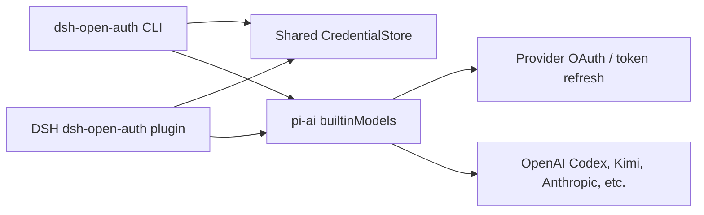

# dsh-open-auth

English | [简体中文](./README.zh-CN.md)

A DeepSeek Harness LLM plugin that connects every chat provider currently built into pi-ai and provides one OAuth/API-key login CLI. The plugin and CLI share a permission-protected credential file, allowing subscriptions such as OpenAI Codex, Kimi Code, and GitHub Copilot to authenticate DSH model requests.

> This does not convert a ChatGPT subscription into an OpenAI API key. The `openai-codex` provider uses the OpenAI Codex OAuth flow and ChatGPT backend implemented by pi-ai. Availability, supported models, and usage limits remain subject to your OpenAI account and applicable service terms.

## Install and build

Node.js 22.19 or later is required.

```bash
npm install
npm run build
npm link
```

Sign in with an OpenAI Codex subscription:

```bash
dsh-open-auth login openai-codex
dsh-open-auth status openai-codex
```

Sign in with a Kimi Code subscription:

```bash
dsh-open-auth login kimi-coding oauth
```

List all providers and models currently exposed by pi-ai:

```bash
dsh-open-auth providers
dsh-open-auth models openai-codex
```

## DSH configuration

Add this package to the plugin list in your DSH `cordis.yml`. The exact parent composition path depends on your DSH deployment:

```yaml
- id: llm-open-auth
  name: dsh-open-auth
  config: {}
```

By default, the plugin registers every built-in pi-ai chat provider. You can restrict it to selected routes:

```yaml
- id: llm-open-auth
  name: dsh-open-auth
  config:
    providers:
      - openai-codex
      - kimi-coding
      - anthropic
      - openrouter
    streamIdleTimeoutMs: 300000
```

Do not load another LLM plugin that owns any of the same provider routes. For example, registering `anthropic` from both this plugin and the official `llm-pi-ai` plugin will be rejected by DSH as a duplicate route.

## Credential storage

Default locations:

- macOS: `~/Library/Application Support/dsh-open-auth/auth.json`
- Linux: `$XDG_CONFIG_HOME/dsh-open-auth/auth.json` or `~/.config/dsh-open-auth/auth.json`
- Windows: `%APPDATA%/dsh-open-auth/auth.json`

Use `--file PATH` in the CLI, set `credentialFile` in the plugin configuration, or set `DSH_OPEN_AUTH_FILE` for both. The file is created with mode `0600`, replaced atomically, and protected by a cross-process lock during writes and token refreshes. It is not an operating-system keychain and has no additional encryption; never upload, share, or commit it to Git.

API-key providers may continue to use the standard environment variables supported by pi-ai, such as `OPENAI_API_KEY`, `ANTHROPIC_API_KEY`, and `DEEPSEEK_API_KEY`. Running `dsh-open-auth login PROVIDER api_key` stores the key in the shared credential file instead. Ambient-only providers such as AWS Bedrock and Google Vertex read environment variables or local credential files according to pi-ai conventions.

## Architecture



This project does not maintain a duplicate provider allowlist. `builtinModels()` is the single source of truth, so upgrading `@earendil-works/pi-ai` automatically exposes newly built-in providers to the CLI and the default DSH route set.

## Development

```bash
npm run check
npm test
npm run build
```

The DSH message, stream-event, and replay mappings in this project are adapted from the MIT-licensed DeepSeek Harness implementation. See [NOTICE](./NOTICE).
