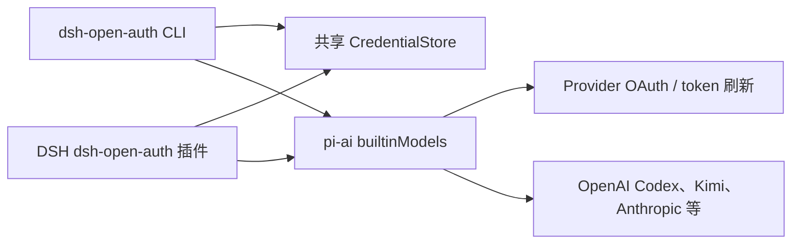

# dsh-open-auth

[English](./README.md) | 简体中文

一个 DSH LLM 插件，同时接入 pi-ai 当前内置的所有聊天 Provider，并提供统一的 OAuth/API Key 登录 CLI。插件和 CLI 共用同一个受文件权限保护的令牌文件，因此 OpenAI Codex、Kimi Code、GitHub Copilot 等订阅登录可直接用于 DSH 的模型请求。

> 这不是 OpenAI API Key 到 ChatGPT 订阅的转换。`openai-codex` 使用 pi-ai 实现的 OpenAI Codex OAuth 和 ChatGPT backend；是否可用、支持哪些模型以及额度限制仍由 OpenAI 账户和适用的服务条款决定。

## 安装与构建

要求 Node.js 22.19 或更高版本。

```bash
npm install
npm run build
npm link
```

登录 OpenAI Codex 订阅：

```bash
dsh-open-auth login openai-codex
dsh-open-auth status openai-codex
```

登录 Kimi Code 订阅：

```bash
dsh-open-auth login kimi-coding oauth
```

查看 pi-ai 当前提供的全部 Provider 和模型：

```bash
dsh-open-auth providers
dsh-open-auth models openai-codex
```

## DSH 配置

在 DSH 的 `cordis.yml` 插件列表中使用本包，具体父级组合路径以你的 DSH 部署为准：

```yaml
- id: llm-open-auth
  name: dsh-open-auth
  config: {}
```

默认注册 pi-ai 的全部内置聊天 Provider。也可以只注册需要的路由：

```yaml
- id: llm-open-auth
  name: dsh-open-auth
  config:
    providers:
      - openai-codex
      - kimi-coding
      - anthropic
      - openrouter
    streamIdleTimeoutMs: 300000
```

不要同时加载另一个占用相同 Provider 路由的 LLM 插件。例如，同时让本插件和官方 `llm-pi-ai` 注册 `anthropic` 时，DSH 会按设计拒绝重复路由。

## 凭据存储

默认位置：

- macOS: `~/Library/Application Support/dsh-open-auth/auth.json`
- Linux: `$XDG_CONFIG_HOME/dsh-open-auth/auth.json` 或 `~/.config/dsh-open-auth/auth.json`
- Windows: `%APPDATA%/dsh-open-auth/auth.json`

可以在 CLI 使用 `--file PATH`，在插件中设置 `credentialFile`，或统一设置 `DSH_OPEN_AUTH_FILE`。文件以 `0600` 权限创建，更新使用同目录原子替换；写入和 token 刷新通过跨进程锁串行化。该文件不是系统钥匙串，也没有额外加密；不要上传、共享或提交到 Git。

API Key Provider 也可继续使用 pi-ai 支持的标准环境变量，例如 `OPENAI_API_KEY`、`ANTHROPIC_API_KEY`、`DEEPSEEK_API_KEY`。执行 `dsh-open-auth login PROVIDER api_key` 则会将 key 存入共享凭据文件。AWS Bedrock、Google Vertex 等 ambient-only Provider 按 pi-ai 约定读取环境变量或本机凭据文件。

## 架构



本项目不会重复维护 Provider 白名单；`builtinModels()` 是唯一来源。因此升级 `@earendil-works/pi-ai` 后，新内置 Provider 会自动进入 CLI 和默认 DSH 路由。

## 开发

```bash
npm run check
npm test
npm run build
```

本项目的 DSH 消息、流事件和 replay 映射基于 DeepSeek Harness 的 MIT 实现调整，详见 [NOTICE](./NOTICE)。
